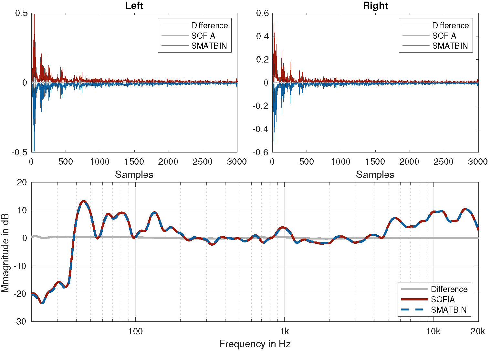

## SMATBIN - Spherical Microphone Array To Binaural
This repository contains the Matlab implementation of the SMATBIN filter approach, proposed in:  
> J.M. Arend, T. Lübeck, and C. Pörschmann, "Efficient binaural rendering of spherical microphone array data by linear filtering",  
> Submitted for publication

The repository provides functions to calculate SMATBIN filters for arbitrary spherical microphone array (SMA) configurations and head orientations as well as functions to generate the plots presented in the paper. Furthermore, the repository includes demo implementations for binaural rendering of simulated and measured (more complex) SMA data using the proposed SMATBIN filter approach as well as an integration example using the SoundScape Renderer [1].

## Dependencies:
* [SOFiA toolbox](https://github.com/AudioGroupCologne/SOFiA)
* [AKtools](https://www.ak.tu-berlin.de/menue/publications/open_research_tools/aktools/)

## DEMO 1 - Apply SMATBIN filters to simulated plane wave
SMATBIN filters and SOFiA rendering chain (virtual loudspeaker approach) applied to a simulated plane wave.

## DEMO 2 - Apply SMATBIN filters to measured SMA data
SMATBIN filters and SOFiA rendering chain (virtual loudspeaker approach) applied to measured SMA impulse responses (Control Room 1 of [2]) for different SMATBIN filter lengths. 

#### SOFiA vs SMATBIN - SMATBIN filter length 512 taps

#### SOFiA vs SMATBIN - SMATBIN filter length 1024 taps

#### SOFiA vs SMATBIN - SMATBIN filter length 2048 taps

## DEMO 3 - Integration example using the SoundScape Renderer
Calculation of SMATBIN filters for a 19 channel Zylia ZM-1 SMA, which can be used for real-time dynamic binaural synthesis of Zylia ZM-1 captures using the SoundScape Renderer (SSR) [2].

* `DEMO_gen_SMATBIN_for_SSR.m` calculates and exports SMATBIN filters for 360 horizontal head orientations in the SSR-BRS format. Additionally, a `*.asd` file (SSR scene description) is generated, which can be loaded with the SSR
* Using a Jack server [3], the SMA signals can be routet to the SSR

#### Screenshot of the Jack routing and the SSR

## REFERENCES:
[1] M. Geier, J. Ahrens, and S. Spors, “The SoundScape Renderer: A Unified Spatial Audio Reproduction Framework for Arbitrary Rendering Methods,” in Proceedings of the 124th AES Convention, Amsterdam, The Netherlands, 2008, pp. 1–6.

[2] P. Stade, B. Bernschütz, and M. Rühl, “A Spatial Audio Impulse Response Compilation Captured at the WDR Broadcast Studios,” in Proceedings of the 27th Tonmeistertagung - VDT International Convention, 2012, pp. 1–17.

[3] https://jackaudio.org
